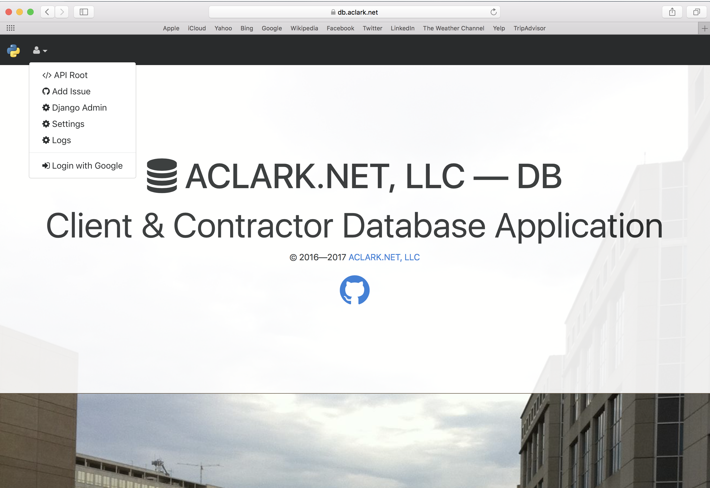
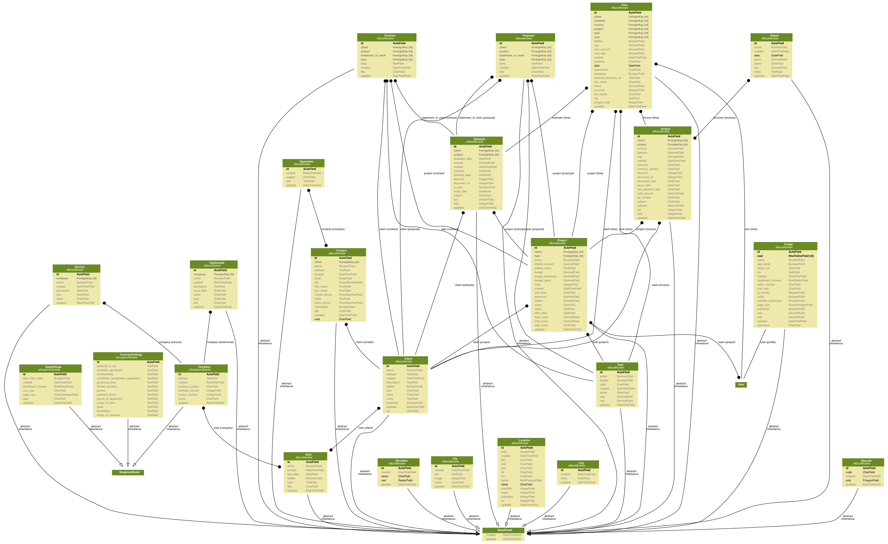

ACLARK.NET, LLC — DB
====================

Client & Contractor Database Application
----------------------------------------

Based on data exported from `Harvest <https://www.getharvest.com/>`_

Models
~~~~~~

Social
~~~~~~

- http://artandlogic.com/2014/04/tutorial-adding-facebooktwittergoogle-authentication-to-a-django-application/
- https://console.developers.google.com/

AWS
~~~

::

    Ubuntu 16.04.1 LTS

::

    sudo add-apt-repository ppa:certbot/certbot
    sudo apt-get update
    sudo apt-get install aptitude awscli graphviz graphviz-dev jq letsencrypt \
        libpq-dev libxml2 libxml2-dev libxslt-dev make nginx pkg-config       \
        libgdal-dev \
        postgresql python python-pip python3 python3-pip python-virtualenv    \
        python3-virtualenv python-dev -y
    sudo aptitude upgrade -y
    sudo add-apt-repository ppa:git-core/ppa

systemd
~~~~~~~

::

    sudo systemctl enable /srv/aclarknet-database/systemd/db.service 
    sudo systemctl enable /srv/aclarknet-database/systemd/db.socket
    sudo systemctl start db.service 
    sudo systemctl start db.socket

NGINX
~~~~~

::

    cd /etc/nginx/sites-enabled
    sudo ln -s /srv/aclarknet-database/nginx/db

Letsencrypt
~~~~~~~~~~~

::

    sudo certbot certonly

::

    Saving debug log to /var/log/letsencrypt/letsencrypt.log

    How would you like to authenticate with the ACME CA?
    -------------------------------------------------------------------------------
    1: Spin up a temporary webserver (standalone)
    2: Place files in webroot directory (webroot)
    -------------------------------------------------------------------------------
    Select the appropriate number [1-2] then [enter] (press 'c' to cancel): 1
    Starting new HTTPS connection (1): acme-v01.api.letsencrypt.org
    Please enter in your domain name(s) (comma and/or space separated)  (Enter 'c'
    to cancel):db.aclark.net
    Obtaining a new certificate
    Performing the following challenges:
    tls-sni-01 challenge for db.aclark.net
    Waiting for verification...
    Cleaning up challenges

    IMPORTANT NOTES:
     - Congratulations! Your certificate and chain have been saved at
       /etc/letsencrypt/live/db.aclark.net/fullchain.pem. Your cert will
       expire on 2017-10-06. To obtain a new or tweaked version of this
       certificate in the future, simply run certbot again. To
       non-interactively renew *all* of your certificates, run "certbot
       renew"
     - If you like Certbot, please consider supporting our work by:

       Donating to ISRG / Let's Encrypt:   https://letsencrypt.org/donate
       Donating to EFF:                    https://eff.org/donate-le

Django
~~~~~~

If memory < 1G, add the following to ``rc.local``. [1]_

::

    sudo dd if=/dev/zero of=/swapfile bs=1024 count=524288
    sudo chmod 600 /swapfile
    sudo mkswap /swapfile
    sudo swapon /swapfile

Then:

::

    git clone git@github.com:ACLARKNET/aclarknet-database.git
    sudo mv aclarknet-database /srv
    cd /srv/aclarknet-database
    virtualenv --python=python3 .
    bin/pip install -r requirements.txt

.. [1] http://stackoverflow.com/a/26762938/185820

PostGIS
~~~~~~~

(Via http://docs.aws.amazon.com/AmazonRDS/latest/UserGuide/Appendix.PostgreSQL.CommonDBATasks.html#Appendix.PostgreSQL.CommonDBATasks.PostGIS)

::

    create extension postgis;
    create extension fuzzystrmatch;
    create extension postgis_tiger_geocoder;
    create extension postgis_topology;

::

    postgres=> \dn
         List of schemas
         Name     |   Owner
    --------------+-----------
     public       | myawsuser
     tiger        | rdsadmin
     tiger_data   | rdsadmin
     topology     | rdsadmin
    (4 rows) 

::

    alter schema tiger owner to rds_superuser;
    alter schema tiger_data owner to rds_superuser;
    alter schema topology owner to rds_superuser;

::

    postgres=> \dn
           List of schemas
         Name     |     Owner
    --------------+---------------
     public       | myawsuser
     tiger        | rds_superuser
    tiger_data    | rds_superuser
     topology     | rds_superuser
    (4 rows) 

::

    CREATE FUNCTION exec(text) returns text language plpgsql volatile AS $f$ BEGIN EXECUTE $1; RETURN $1; END; $f$;

::

    SELECT exec('ALTER TABLE ' || quote_ident(s.nspname) || '.' || quote_ident(s.relname) || ' OWNER TO rds_superuser;')
      FROM (
        SELECT nspname, relname
        FROM pg_class c JOIN pg_namespace n ON (c.relnamespace = n.oid) 
        WHERE nspname in ('tiger','topology') AND
        relkind IN ('r','S','v') ORDER BY relkind = 'S')
    s;
      
::

    SET search_path=public,tiger;         
      
::

    select na.address, na.streetname, na.streettypeabbrev, na.zip
    from normalize_address('1 Devonshire Place, Boston, MA 02109') as na;

::

    address | streetname | streettypeabbrev |  zip
    ---------+------------+------------------+-------
           1 | Devonshire | Pl               | 02109
    (1 row) 

::

    select topology.createtopology('my_new_topo',26986,0.5);

::

    createtopology
    ----------------
                  1
    (1 row) 

git-lfs
~~~~~~~

(Via https://askubuntu.com/a/799451, https://github.com/git-lfs/git-lfs/wiki/Installation#ubuntu)

::

    curl -s https://packagecloud.io/install/repositories/github/git-lfs/script.deb.sh | sudo bash
    sudo apt-get install git-lfs

::

    cd /srv/aclarknet-database
    git lfs fetch
    git lfs checkout

Features
--------

- CRUD for the following models:
    - Client
    - Contact
    - Contract
    - Company
    - Estimate
    - Invoice
    - Newsletter
    - Note
    - Report
    - Service
    - Testimonial
    - Time
    - Task
    - Proposal

- Other models:
    - ContractSettings
    - Elevation
    - Log
    - Profile
    - Project
    - Settings
    - Zipcode

- Time entry and invoice generation
- Activate and deactive objects

WhiteNoise
----------

(Via http://whitenoise.evans.io/en/stable/)

::

    MIDDLEWARE_CLASSES = [
      # 'django.middleware.security.SecurityMiddleware',
      'whitenoise.middleware.WhiteNoiseMiddleware',
      # ...
    ]

::

    STATICFILES_STORAGE = 'whitenoise.storage.CompressedManifestStaticFilesStorage'

::

    from whitenoise import WhiteNoise

    from my_project import MyWSGIApp

    application = MyWSGIApp()
    application = WhiteNoise(application, root='/path/to/static/files')
    application.add_files('/path/to/more/static/files', prefix='more-files/')

Webpack
-------

- http://geezhawk.github.io/using-react-with-django-rest-framework
- http://owaislone.org/blog/webpack-plus-reactjs-and-django/

.bashrc
-------

::

    set -o vi
    # https://unix.stackexchange.com/questions/79064/how-to-export-variables-from-a-file
    source /srv/aclarknet-env/db
    export $(cut -d= -f1 /srv/aclarknet-env/db)

GitHub
------

(Via https://gist.github.com/gubatron/d96594d982c5043be6d4)

::

    Host repo1.github.com
      HostName github.com
      User git
      IdentityFile /home/alice/.ssh/repo1.alice_github.id_rsa
      IdentitiesOnly yes

    Host repo2.github.com
      HostName github.com
      User git
      IdentityFile /home/alice/.ssh/repo2.alice_github.id_rsa
      IdentitiesOnly yes

Env
---

`.bashrc`::

    # https://unix.stackexchange.com/questions/79064/how-to-export-variables-from-a-file
    source /srv/aclarknet-env/db
    export $(cut -d= -f1 /srv/aclarknet-env/db)
    export EDITOR=vim
