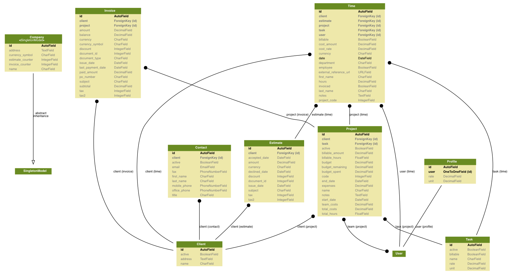

ACLARK.NET, LLC — DB
====================

Client & Contractor Database Application
----------------------------------------

Based on data exported from `Harvest <https://www.getharvest.com/>`_

Heroku
~~~~~~

::

    git remote add heroku git@heroku.com:aclarknet-database.git
    git remote add heroku git@heroku.com:aclarknet-database2.git

Social
~~~~~~

- http://artandlogic.com/2014/04/tutorial-adding-facebooktwittergoogle-authentication-to-a-django-application/
- https://console.developers.google.com/

Models
~~~~~~

AWS
~~~

::

    Ubuntu 16.04.1 LTS

::

    sudo apt-get update
    sudo apt-get install aptitude awscli graphviz graphviz-dev jq letsencrypt \
        libpq-dev libxml2 libxml2-dev libxslt-dev make nginx pkg-config       \
        postgresql python python-pip python3 python3-pip python-virtualenv    \
        python3-virtualenv python-dev -y
    sudo aptitude upgrade

systemd
~~~~~~~

::

    # sudo mkdir /run/gunicorn
    # sudo chown ubuntu:ubuntu /run/gunicorn/
    sudo systemctl enable gunicorn.socket
    sudo systemctl start gunicorn.socket

gunicorn.service
++++++++++++++++

::

    [Unit]
    Description=gunicorn daemon
    Requires=gunicorn.socket
    After=network.target

    [Service]
    # env | sort > /srv/aclarknet-database/env
    EnvironmentFile=/srv/aclarknet-database/env

    PIDFile=/run/gunicorn/pid
    User=ubuntu
    Group=ubuntu
    RuntimeDirectory=gunicorn
    WorkingDirectory=/srv/aclarknet-database
    ExecStart=/srv/aclarknet-database/bin/gunicorn -c /srv/aclarknet-database/logging.conf --pid /run/gunicorn/pid --bind unix:/run/gunicorn/socket aclarknet.wsgi
    ExecReload=/bin/kill -s HUP $MAINPID
    ExecStop=/bin/kill -s TERM $MAINPID
    PrivateTmp=true

    [Install]
    WantedBy=multi-user.target

gunicorn.socket
+++++++++++++++

::

    [Unit]
    Description=gunicorn socket

    [Socket]
    ListenStream=/run/gunicorn/socket

    [Install]
    WantedBy=sockets.target

NGINX
~~~~~

/etc/nginx/sites-enabled/default 
++++++++++++++++++++++++++++++++

::

    server {
        listen 443 ssl default_server;
        listen [::]:443 ssl default_server;

        ssl    on;
        ssl_certificate    /etc/letsencrypt/live/db.aclark.net/fullchain.pem;
        ssl_certificate_key    /etc/letsencrypt/live/db.aclark.net/privkey.pem;

        root /var/www/html;

        index index.html index.htm index.nginx-debian.html;

        server_name _;

        location / {
            proxy_pass http://unix:/run/gunicorn/socket;
            proxy_set_header Host      $host;
            proxy_set_header X-Real-IP $remote_addr;
        }
    }

    server {
        listen 80;
        listen [::]:80;

        server_name _;

        root /var/www/example.com;
        index index.html;

        location / {
            try_files $uri $uri/ =404;
        }

        return 301 https://$host$request_uri;
    }

Letsencrypt
~~~~~~~~~~~

::

    $ sudo letsencrypt certonly

    …

    IMPORTANT NOTES:
     - Congratulations! Your certificate and chain have been saved at
       /etc/letsencrypt/live/db.aclark.net/fullchain.pem. Your cert will
       expire on 2017-06-08. To obtain a new version of the certificate in
       the future, simply run Let's Encrypt again.
     - If you like Let's Encrypt, please consider supporting our work by:

       Donating to ISRG / Let's Encrypt:   https://letsencrypt.org/donate
       Donating to EFF:                    https://eff.org/donate-le

Django
~~~~~~

If memory < 1G, increase swap before installing. [1]_

::

    sudo dd if=/dev/zero of=/swapfile bs=1024 count=524288
    sudo chmod 600 /swapfile
    sudo mkswap /swapfile
    sudo swapon /swapfile

Then:

::

    git clone git@github.com:ACLARKNET/aclarknet-database.git
    sudo mv aclarknet-database /srv
    cd /srv/aclarknet-database
    virtualenv --python=python3 .
    bin/pip install -r requirements.txt

.. [1] http://stackoverflow.com/a/26762938/185820
